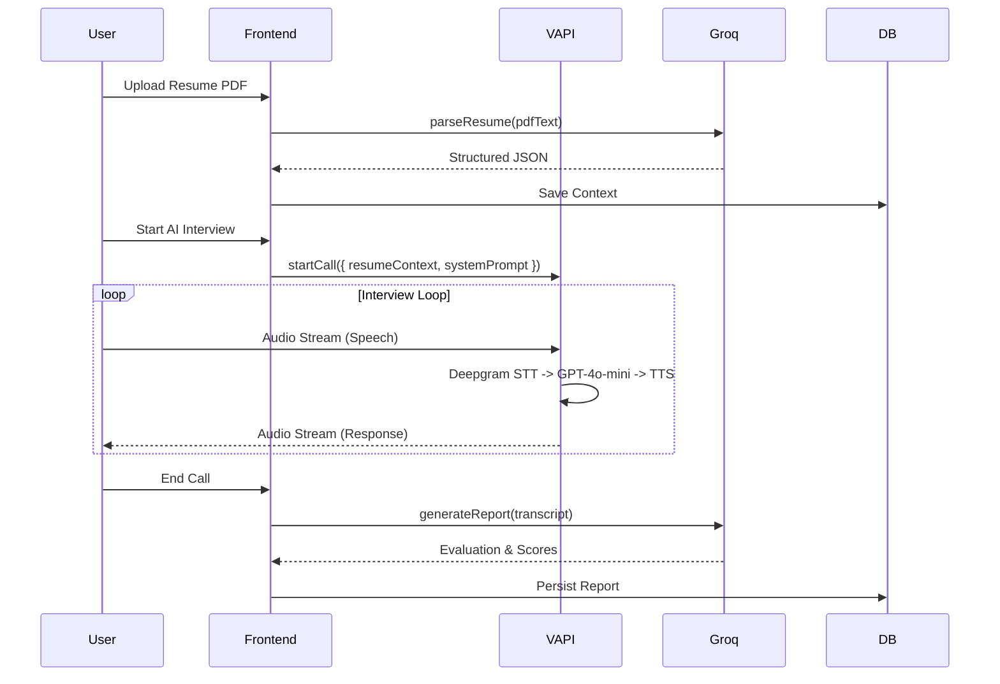

# 🚀 PrepWise — Production-Grade AI Interview Platform

<div align="center">

[](https://nextjs.org)
[](https://typescriptlang.org)
[](https://prisma.io)
[](https://neon.tech)
[](https://docker.com)
[](https://vapi.ai)

**A FAANG-caliber interview preparation platform combining real-time Voice AI, sandboxed code execution, intelligent resume parsing, and structured engineering roadmaps.**

[Frontend Documentation](./frontend/README.md) · [Backend Documentation](./backend/README.md)

</div>

---

## 📖 Project Vision
PrepWise bridges the gap between passive learning and active interview execution. Instead of just reading solutions, engineers engage in **real-time, bidirectional voice interviews** with an AI trained on their specific resume and target job description. Coupled with a sandboxed code execution environment supporting 12+ languages, PrepWise offers an end-to-end simulation of top-tier technical interviews.

---

## 🏗️ System Architecture

PrepWise utilizes a **decoupled monorepo architecture** designed for high availability and horizontal scaling.

```mermaid
graph TD
    User["🌐 Client Browser"]

    subgraph "Frontend Layer (Vercel / Next.js 16)"
        AppRouter["App Router (RSC + SSR)"]
        ServerActions["Server Actions"]
        APIRoutes["Next.js Edge API Routes"]
        WebRTC["Stream Video SDK"]
    end

    subgraph "Voice AI Pipeline"
        VapiSDK["VAPI Web SDK"]
        Deepgram["Deepgram (STT)"]
        OpenAI["OpenAI (LLM + TTS)"]
    end

    subgraph "Backend API Layer (Express.js)"
        CodeRunner["Execution Controller"]
        ATSScorer["AI ATS Engine"]
        ContentAPI["DSA & Learn API"]
    end

    subgraph "Infrastructure & Data"
        NeonDB[("Neon Serverless Postgres")]
        Judge0["Judge0 Code Sandbox (Docker)"]
        Groq["Groq LPU Inference"]
        Clerk["Clerk Auth"]
    end

    User <-->|React Server Components| AppRouter
    User <-->|WebSocket Audio| VapiSDK
    User <-->|WebRTC Video| WebRTC
    
    AppRouter -->|GraphQL/REST| Clerk
    ServerActions -->|Connection Pool| NeonDB
    APIRoutes -->|Proxy| Backend API Layer
    APIRoutes -->|Fast Inference| Groq
    
    VapiSDK --> Deepgram
    Deepgram --> OpenAI
    
    CodeRunner -->|Sandboxed Execution| Judge0
    ATSScorer -->|Model Inference| Groq
    ContentAPI -->|Connection Pool| NeonDB
```

---

## 🧠 AI Pipeline Architecture

The system utilizes specialized AI models for different tasks to optimize for latency, cost, and accuracy:

1. **Voice Interviews (VAPI + Deepgram + OpenAI)**
   - Requires extreme low latency (< 500ms TTFB).
   - We use VAPI's Transient Assistants. Audio is streamed to Deepgram (`nova-2`) for STT, context is passed to OpenAI (`gpt-4o-mini`), and audio is generated via OpenAI's TTS (`nova`).
2. **Resume Parsing & ATS Scoring (Groq + LLaMA 3)**
   - Requires massive token throughput.
   - We use Groq's LPU architecture with `llama-3.3-70b-versatile` to parse unstructured PDF text into structured JSON and provide instant ATS scoring.
3. **Interview Evaluation (Groq)**
   - Post-interview, the entire JSON transcript is sent to Groq to generate a 0-100 technical score, strengths, and weaknesses map.



---

## 💻 Code Execution Architecture

The backend handles arbitrary user code via an isolated, containerized execution environment.

1. **Request**: Next.js POSTs source code, language ID, and test cases to Express backend.
2. **Orchestration**: Backend forwards payload to Judge0 API.
3. **Isolation**: Judge0 spawns an ephemeral Docker container with strict `cgroups` limits (e.g., max 5s CPU, 128MB RAM, restricted network).
4. **Execution**: Code is compiled and run against inputs.
5. **Teardown**: Container is destroyed, preventing container escapes or zombie processes.
6. **Response**: Standard out, errors, execution time, and memory usage are returned.

---

## 🔐 Security & Auth Model

- **Authentication**: Zero-trust architecture using Clerk. The Next.js `clerkMiddleware` wraps all routes.
- **Authorization**: API routes invoke `auth().protect()`. Every Prisma query strictly filters by `userId` (Tenant Isolation).
- **Transient Assistants**: AI agents are created ephemerally per session. No sensitive resume data is permanently stored in third-party AI dashboards.
- **Payload Validation**: Zod schemas validate all API inputs to prevent injection attacks.
- **Execution Sandboxing**: User code runs inside isolated Docker containers without host network access.

---

## 📈 Scaling Strategy

| Component | Scaling Strategy |
|---|---|
| **Database** | Neon Postgres scales compute to zero when idle and instantly provisions resources under load. Connection pooling (PgBouncer) is native. |
| **Frontend** | Vercel Edge Network. Next.js App Router aggressively caches static roadmaps and cheatsheets at the edge. |
| **Backend** | Stateless Node.js Express servers. Can be horizontally scaled behind a load balancer. State is entirely in Postgres. |
| **AI Inference** | Groq handles sudden spikes with deterministic token generation speeds (~300 t/s). |
| **Code Execution** | Judge0 workers can be scaled horizontally across multiple compute nodes via Redis queue. |

---

## 🛠️ Technology Rationale

| Technology | Why It Was Chosen |
|---|---|
| **Next.js 16 (App Router)** | RSC drastically reduces client bundle size. Server Actions eliminate the need for boilerplate API orchestration layers. |
| **Prisma ORM** | Type-safety from database to frontend. Catch schema errors at compile-time, not runtime. |
| **VAPI.ai** | Managing WebRTC, Deepgram WebSockets, and OpenAI streaming manually introduces 1s+ latency. VAPI handles the pipeline orchestration natively. |
| **Judge0 + Docker** | Building a secure RCE (Remote Code Execution) engine from scratch is an anti-pattern. Judge0 provides production-ready sandboxing. |
| **Zustand** | React Context causes cascading re-renders for deep component trees (like the resume builder). Zustand provides targeted slice updates. |

---

## ⚙️ Environment Variables Overview

See individual READMEs for detailed setups, but the core infrastructure requires:

| Category | Variables | Location |
|---|---|---|
| **Database** | `DATABASE_URL` (Pooled) | Frontend & Backend |
| **Auth (Clerk)** | `NEXT_PUBLIC_CLERK_PUBLISHABLE_KEY`, `CLERK_SECRET_KEY` | Frontend |
| **Video (Stream)** | `STREAM_API_KEY`, `STREAM_SECRET` | Frontend & Backend |
| **Voice AI (VAPI)** | `NEXT_PUBLIC_VAPI_API_KEY`, `VAPI_API_KEY` | Frontend |
| **LLM (Groq)** | `GROK_API_KEY`, `GROK_BASE_URL` | Frontend & Backend |
| **Execution** | `JUDGE0_API_URL`, `JUDGE0_API_KEY` | Backend |

---

## 🚀 Deployment

### 1. Frontend (Vercel)
The Next.js app is optimized for Vercel. 
1. Connect GitHub repo to Vercel.
2. Set framework to `Next.js`.
3. Add all frontend environment variables.
4. Deploy. Vercel automatically handles Edge caching and Serverless functions.

### 2. Backend (Docker / Render / Railway)
The backend requires system dependencies (Python, Java, G++) if executing code locally, or just Node.js if using RapidAPI Judge0.
```bash
# Build the production Docker image
docker build -t prepwise-backend ./backend

# Run the container
docker run -p 5000:5000 --env-file ./backend/.env prepwise-backend
```

### 3. Database (Neon)
1. Provision a Neon project.
2. Run Prisma migrations from the frontend: `npx prisma migrate deploy`
3. Run seed scripts from the backend: `npm run seed:problems`, `npm run seed:roadmaps`

---

## 🐛 Troubleshooting

- **AI Not Listening / Disconnecting immediately**: Caused by WebRTC microphone conflicts. Ensure you aren't manually calling `getUserMedia` alongside Stream Video SDK. Check VAPI Public Key "Transient Assistant" permissions.
- **Prisma "Too many connections"**: Ensure you are using the Neon **Pooled** connection string (`?pgbouncer=true` or pooler endpoint), NOT the direct connection string.
- **Judge0 Timeout**: If self-hosting, ensure your Docker VM has enough CPU resources allocated, or increase `JUDGE0_CPU_LIMIT`.
