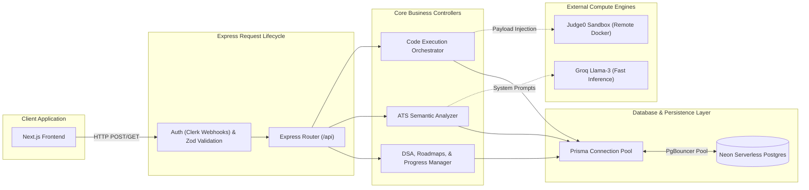

# ⚙️ PrepWise Backend Infrastructure Deep Dive

> **Node.js 18** · Express.js · Judge0 (Docker) · Prisma ORM · PostgreSQL · Groq AI LPUs

The PrepWise Backend is a **highly-concurrent, stateless API Gateway and Processing Engine**. It is explicitly engineered to handle the most computationally expensive and security-sensitive operations of the platform: Executing untrusted code in Docker containers, streaming large texts through Groq AI for ATS scoring, and delivering massive relational datasets for learning roadmaps.

---

## 🏛️ In-Depth Backend Architecture

The backend completely decouples HTTP transport from business logic using a strict **Route -> Controller -> Service** pattern. 



---

## 📁 Complete Backend File & Folder Tree

Below is the exhaustive layout of the `backend` directory, detailing exactly what drives the server.

```text
d:\prep-wise\backend\
├── ai/                                   # Artificial Intelligence Services
│   └── ats.js                            # The sophisticated 2-pass ATS Engine. Combines deterministic Regex with Groq semantic analysis.
│
├── controllers/                          # Business Logic Handlers
│   └── execution.controller.js           # Handles payload standardization, test-case fetching, and Judge0 proxying.
│
├── routes/                               # Express HTTP Endpoint Definitions
│   ├── ats.js                            # POST /api/ats - Triggers resume scoring against a job description.
│   ├── auth.js                           # POST /api/auth/webhook - Secure endpoint listening to Clerk to create/delete users.
│   ├── cheatsheets.js                    # GET /api/cheatsheets - Delivers static markdown tech references.
│   ├── dsa.js                            # GET /api/dsa - Fetches the Master 250 problems, optimal solutions, and categories.
│   ├── execution.routes.js               # POST /api/execution/run - The entrypoint for all code sandbox requests.
│   ├── judge.js                          # Webhook receiver for async Judge0 responses (if configured).
│   ├── learn.js                          # Endpoints for serving specific course modules and video metadata.
│   ├── progress.js                       # POST /api/progress - Updates junction tables tracking user completion states.
│   └── roadmaps.js                       # GET /api/roadmaps - Delivers the deeply nested Roadmap -> Phase -> Module JSON tree.
│
├── prisma/                               # Database ORM & Schemas
│   ├── schema.prisma                     # The single source of truth for the entire database structure.
│   ├── seed.js                           # Master Orchestrator: runs all subsequent seed scripts in order.
│   ├── seedAIML.js                       # Injects massive AI/ML curriculum data (PyTorch, TensorFlow nodes).
│   ├── seedCheatsheets.js                # Parses and injects markdown cheatsheet files into the DB.
│   ├── seedFullStack.js                  # Injects the complex Full Stack Web Development roadmap graph.
│   ├── seedMaster250.js                  # Core FAANG-level DSA problem injections (Descriptions, Difficulty).
│   ├── seedPatterns.js                   # Categorization maps (Sliding Window, Two Pointers, Trees).
│   ├── seedRoadmaps.js                   # Generic roadmap table initialization.
│   ├── seedSolution.js                   # Massive script injecting Brute Force and Optimal solutions in Python, Java, C++.
│   ├── seedTestCases.js                  # Injects hidden input/output string pairs for Judge0 execution validation.
│   └── syncAIMLContent.js                # Utility to pull and sync external markdown content into the DB.
│
├── .env                                  # Private server credentials (DATABASE_URL, GROK_API_KEY, JUDGE0 keys).
├── Dockerfile                            # Production-ready multi-stage build image.
└── index.js                              # Express initialization, CORS configuration, Middleware binding, and Server Listen.
```

---

## 🔄 The Complete Backend Execution Workflows

### 1. Remote Code Execution Pipeline (`/controllers/execution.controller.js`)
Executing untrusted user code is incredibly dangerous. We manage this via Judge0.
- **The Request**: The Next.js frontend POSTs a payload containing `{ source_code, language_id, stdin, problemId }`.
- **Validation & Test Cases**: The Express controller queries Prisma to fetch the hidden test cases associated with `problemId`.
- **Proxy to Judge0**: The payload is securely mapped to Judge0's expected format and sent to the Judge0 API.
- **The Sandbox**: Judge0 mounts the code inside an isolated Docker container based on the `language_id` (e.g., Python 3.10, Java 17).
- **Resource Constraints**: The Docker container is restricted by Linux `cgroups`. It is hard-capped at 5 seconds of CPU time and 128MB of RAM. If the user writes `while(true) {}`, the container is killed automatically (Status: Time Limit Exceeded).
- **Result Diffing**: Judge0 returns `stdout`, `stderr`, and `compile_output`. The Express backend compares the `stdout` against the expected test case outputs. If they match, the submission is marked as `Accepted` in the Prisma Database.

### 2. The AI ATS Scoring Engine (`/ai/ats.js`)
We use a **Two-Pass System** to evaluate a resume against a job description.
- **Pass 1: Deterministic Regex (Speed)**: The engine extracts the raw resume text and runs it against a massive internal dictionary array of Action Verbs, Technical Skills, and Soft Skills. This calculates a baseline mathematical score instantly.
- **Pass 2: Groq Semantic Analysis (Depth)**: The text is formatted into a massive prompt alongside the Job Description and proxied to the Groq API (using LLaMA 3). 
- **Why Groq?**: Evaluating a resume and job description requires reading ~3,000 tokens. A standard OpenAI API call could take 10-15 seconds, risking HTTP timeouts. Groq's Language Processing Units (LPUs) evaluate and generate the response in **~1.5 seconds**. Groq outputs a strict JSON block detailing semantic weaknesses and actionable bullet-point rewrites.

### 3. Deep Relational Content Delivery (`/routes/roadmaps.js`)
- The backend serves as a highly optimized content delivery system. 
- Using Prisma's `include` syntax, a single request to `/api/roadmaps` performs complex SQL `JOIN` operations: It fetches the Roadmap, all associated Phases, all Modules within those Phases, AND the current authenticated user's `UserProgress` for every single module.
- This allows the frontend to render the entire stateful roadmap tree in one pass.

---

## 🗄️ The Prisma Seeding Strategy

The `prisma/` directory contains almost 10 massive JavaScript seeding files. Why? Because a learning platform is useless without content. 
To guarantee every instance of PrepWise has access to a complete platform immediately, these scripts programmatically inject megabytes of data directly into PostgreSQL.

- **`seedMaster250.js` & `seedTestCases.js`**: Populates the database with 250 FAANG questions, alongside their hidden test cases.
- **`seedSolution.js`**: An enormous script that injects optimal and brute-force solutions (complete with Time/Space complexity explanations) in Python, Java, and C++ for every problem.
- **`seedFullStack.js` & `seedAIML.js`**: Constructs the relational graph for the Roadmaps, mapping exactly what order a user should learn technologies.

---

## 🚀 Scaling & Production Deployments

The backend is built to scale horizontally infinitely.

1. **Absolute Statelessness**: 
   The Express app maintains zero local state, zero memory caches, and zero session files. Sessions are validated via Clerk JWTs, and all data lives in Neon. You can spin up 1 or 1,000 Express containers behind a Load Balancer, and they will all function identically.

2. **PgBouncer Connection Pooling**: 
   Serverless Postgres architectures (like Neon) drop idle connections rapidly. If 500 users submit code simultaneously, Node.js will attempt to open 500 direct database connections, instantly crashing Postgres. The backend's `DATABASE_URL` is configured to use a transaction-level PgBouncer pool URL, securely multiplexing connections.

3. **Graceful Shutdown Hooks**: 
   When deploying new versions (or scaling down), Kubernetes/Docker sends a `SIGTERM` signal. `index.js` intercepts this and explicitly calls `prisma.$disconnect()`. This ensures no dangling database connections remain active during rollouts.

---

## 🔐 Core API Endpoints Reference

| Endpoint | Method | Security | Purpose |
|---|---|---|---|
| `/api/execution/run` | POST | Authenticated | Sends code to Judge0, compares output, updates DB |
| `/api/ats/score` | POST | Authenticated | Triggers the Groq 2-pass resume scoring engine |
| `/api/dsa/problems` | GET | Public | Fetches the paginated list of Master 250 problems |
| `/api/dsa/problem/:id` | GET | Public | Fetches problem description, hints, and test cases |
| `/api/progress/mark` | POST | Authenticated | Upserts a completed module record for a user |
| `/api/auth/webhook` | POST | Svix Verified | Clerk identity sync (creates local User record) |
