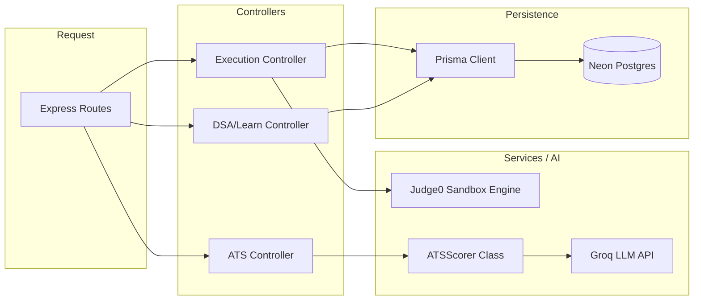

# ⚙️ PrepWise Backend Infrastructure

> **Node.js 18** · Express · Judge0 (Docker) · Prisma · PostgreSQL · Groq AI

The backend is a **highly-concurrent API service** tasked with handling computationally heavy operations: Sandboxed Code Execution, AI-driven ATS resume scoring, and serving complex relational learning content.

---

## 🏛️ API Architecture

The backend follows a standard Controller-Service-Route pattern, ensuring business logic is decoupled from HTTP transport.



---

## 🏃 Code Execution Pipeline

The execution engine (`routes/execution.routes.js`) safely executes untrusted user code.

### The Request Lifecycle
1. Frontend POSTs `{ source_code, language_id, stdin }`.
2. Backend intercepts and normalizes the payload.
3. Submits via HTTP to Judge0 API (Internal or RapidAPI hosted).
4. **Sandboxing**: Judge0 mounts the code inside an isolated Docker container based on the `language_id` (e.g., Python 3, Java 17).
5. **Resource Limits**: The container is constrained by `cgroups` (e.g., 5 seconds CPU time, 128MB RAM).
6. Execution completes. Judge0 returns `stdout`, `stderr`, and execution metadata.
7. If it's a "Submit" request, the backend iterates through all test cases, compares outputs, and persists the result to the `Submission` table via Prisma.

### Security Considerations
- Never execute code directly on the host Node.js process.
- Docker containers run without network privileges to prevent data exfiltration.
- `ulimit` and `cgroups` prevent fork bombs and memory exhaustion attacks.

---

## 🧠 AI ATS Scoring Engine

The backend includes a sophisticated ATS (Applicant Tracking System) simulation engine (`ai/ats.js`).

**Phase 1: Deterministic Keyword Parsing (Fast)**
- Extracts text and compares against a massive internal dictionary of Action Verbs, Technical Skills, and Soft Skills using Regex. Calculates a base score.

**Phase 2: LLM Narrative Analysis (Deep)**
- Formats the resume and Job Description, and proxies it to **Groq**.
- Groq evaluates the semantic fit, identifies missing implicit skills, and generates actionable, paragraph-length feedback in strict JSON format.
- **Why Groq?** Speed. Resume analysis requires reading ~2,000 tokens. Traditional LLMs take 10+ seconds. Groq's LPU does it in ~1.5 seconds, avoiding HTTP timeouts.

---

## 🗄️ Database Seeding & Migrations

The backend repository manages the "source of truth" content via Prisma seeds.

- `npm run seed:problems` - Injects 250+ FAANG-level DSA problems, starter code, solutions (Python/Java/C++), and test cases.
- `npm run seed:roadmaps` - Generates highly structured, phase-by-phase learning paths for SWE, Frontend, Backend, etc.
- `npm run seed:cheatsheets` - Loads Markdown-based technical reference sheets into the DB.

---

## 🚀 Scaling & Concurrency

- **Statelessness**: The Express app maintains zero local state. Sessions are managed by Clerk (JWTs), and data by Neon. You can scale from 1 to 100 Express instances instantaneously behind a Load Balancer.
- **Database Pooling**: Connecting to serverless Postgres requires PgBouncer. The `DATABASE_URL` must use the pooled endpoint, preventing Node.js from exhausting database connections during traffic spikes.
- **Graceful Shutdown**: Intercepts `SIGTERM` and `SIGINT` to call `prisma.$disconnect()` ensuring no dangling connections remain during deployment rollouts.

---

## ⚙️ Environment Variables

| Variable | Description | Required | Example |
|---|---|---|---|
| `PORT` | API listener port | ❌ | `5000` |
| `DATABASE_URL` | Neon Postgres Connection String | ✅ | `postgresql://neondb_owner...` |
| `JWT_SECRET` | Legacy fallback secret | ✅ | `...` |
| `GROK_API_KEY` | Groq API Key for ATS | ✅ | `gsk_...` |
| `JUDGE0_API_URL` | Judge0 Endpoint | ✅ | `https://judge0-ce.p.rapidapi.com` |
| `JUDGE0_API_KEY` | RapidAPI / Judge0 Key | ✅ | `...` |
| `JUDGE0_CPU_LIMIT` | Sandbox Max Time (sec) | ❌ | `5` |
| `JUDGE0_MEM_LIMIT` | Sandbox Max RAM (KB) | ❌ | `131072` |

---

## 🐳 Docker Deployment

The backend ships with a multi-stage Dockerfile that installs all necessary language runtimes if you choose to bypass Judge0 and execute locally (Not recommended for prod, but excellent for dev).

```bash
# Build
docker build -t prepwise-api .

# Run
docker run -p 5000:5000 \
  -e DATABASE_URL="postgresql://..." \
  -e GROK_API_KEY="..." \
  -e JUDGE0_API_URL="..." \
  prepwise-api
```

---

## 🩺 Troubleshooting

**Judge0 API returning 401 or timeouts:**
- **Fix**: Verify `JUDGE0_API_KEY` and `JUDGE0_API_HOST`. If using the free RapidAPI tier, ensure you haven't exceeded the 50 requests/day quota.

**Prisma `kind: Closed` or Timeout Errors:**
- **Fix**: Serverless databases close connections rapidly. Ensure Node.js is using IPv4 first (`dns.setDefaultResultOrder('ipv4first')` is included in `index.js`), and ensure you are using the pooled connection URL, not the direct URL.
