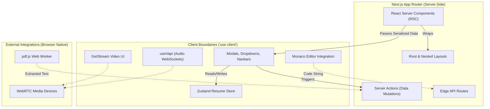

# 🖥️ PrepWise Frontend Architecture Deep Dive

> **Next.js 16 App Router** · React Server Components (RSC) · Server Actions · Zustand · Tailwind CSS v4 · Framer Motion

The PrepWise frontend is a massive, highly-interactive web application. It is engineered to orchestrate complex user interfaces, WebRTC video streams, WebSocket-based AI audio, real-time code execution, and persistent learning management—all while maintaining absolute peak performance, zero-layout-shift, and excellent SEO via React Server Components (RSC).

---

## 📐 In-Depth Frontend Architecture

Our architecture heavily leverages the paradigms introduced in Next.js 14/15/16. We aggressively separate concern between what happens on the server and what happens in the client's browser.



### 1. The Server Component Advantage
Any page that is purely informational (like the `dsa/[slug]` problem descriptions, `/roadmaps`, and `/cheatsheets`) is rendered entirely on the server. **Zero JavaScript** is shipped to the client for these reading-heavy pages. The database is queried directly within the `page.tsx` file, eliminating the need for `useEffect` data fetching or loading spinners.

### 2. State Management Philosophy
We use two distinct state management strategies depending on the feature:
- **React State / Hooks**: Used for localized component states (e.g., dropdowns, modals, Monaco editor input).
- **Zustand**: Used exclusively for the massive **Resume Builder** feature. A resume JSON object contains deeply nested arrays (Education, Experience, Projects). Passing this via React Context would cause the entire application tree to re-render on every keystroke. Zustand allows components to subscribe to only specific slices of the state.

---

## 📁 Complete Frontend File & Folder Tree

Below is the exhaustive layout of the `frontend` directory, detailing exactly what drives the application.

```text
d:\prep-wise\frontend\
├── app/                                  # Next.js App Router Directory
│   ├── (auth)/                           # Route group: Clerk Auth Overlays
│   │   ├── sign-in/[[...sign-in]]/       # Clerk Sign-in Page
│   │   └── sign-up/[[...sign-up]]/       # Clerk Sign-up Page
│   ├── api/                              # Next.js API Routes (Serverless/Edge)
│   │   └── webhooks/                     # Listens for Clerk/Stripe webhooks
│   ├── dsa/                              # The Data Structures & Algo Sandbox
│   │   ├── [slug]/page.tsx               # Dynamic RSC: Fetches specific problem
│   │   └── page.tsx                      # RSC: Lists the Master 250 problems
│   ├── interview/                        # AI Interview Setup & Execution
│   │   ├── ai/room/[id]/page.tsx         # The main WebRTC & VAPI Meeting Room
│   │   └── setup/page.tsx                # Device testing before interview starts
│   ├── resume/                           # AI ATS and Visual Resume Builder
│   │   └── page.tsx                      # Houses the Drag & Drop builder UI
│   ├── learn/                            # Video/Course module viewer
│   ├── roadmaps/                         # Career progression trackers
│   ├── cheatsheets/                      # Static Markdown rendering pages
│   ├── layout.tsx                        # Global layout. Wraps Providers (Clerk, Theme)
│   ├── page.tsx                          # The Landing Page (Marketing, Hero, Pricing)
│   └── globals.css                       # Tailwind v4 injection & CSS variables
│
├── components/                           # Reusable UI Architecture
│   ├── dsa/                              # Code Execution Components
│   │   ├── CodeEditor.tsx                # Monaco editor wrapper with debouncing
│   │   └── TerminalOutput.tsx            # Formats Judge0 stdout/stderr like a real CLI
│   ├── interview/                        # Video & Audio Components
│   │   ├── AIParticipantCard.tsx         # Renders dynamic waveforms based on VAPI volume
│   │   ├── LiveTranscript.tsx            # Maps over VAPI websocket messages in real-time
│   │   └── VideoGrid.tsx                 # Wraps Stream SDK layouts
│   ├── resume/                           # Form components mapping to Zustand
│   │   ├── ResumePreview.tsx             # The live A4 rendering of the JSON state
│   │   └── ExperienceForm.tsx            # Deeply nested field arrays
│   ├── ui/                               # Base Design System (shadcn/ui inspired)
│   │   ├── button.tsx, card.tsx, etc.    # Highly reusable, accessible primitives
│   └── MarkdownRenderer.tsx              # Component to safely parse DB-stored markdown
│
├── hooks/                                # Custom React Hooks
│   ├── useVapi.ts                        # The core of the AI Interview. Manages WebSocket states.
│   ├── useDebounce.ts                    # Rate limits user input (used heavily in Monaco & Search)
│   └── use-mobile.ts                     # Detects viewport for conditional responsive rendering
│
├── lib/                                  # Core Utilities and Integrations
│   ├── ai/                               # LLM Clients
│   │   └── grok.ts                       # Groq Cloud SDK initialization
│   ├── pdf-extractor.ts                  # Extremely important: Client-side PDF.js parsing
│   ├── stream-client.ts                  # Initializes GetStream for WebRTC video
│   ├── vapi.ts                           # Generates dynamic payloads for VAPI Transient Assistants
│   ├── prisma.ts                         # Singleton Prisma client to prevent connection exhaustion
│   └── utils.ts                          # Tailwind `cn()` merger and standard JS utils
│
├── actions/                              # Server Actions (Secure Next.js Mutations)
│   └── resume.actions.ts                 # Mutates the Resume table in the database safely
│
├── prisma/                               # Prisma Client
│   └── schema.prisma                     # Shared symbolic link to the backend schema
├── middleware.ts                         # Clerk Auth Protection (intercepts every request)
├── next.config.ts                        # Webpack & Next.js config (handles Monaco/PDF workers)
└── tailwind.config.ts                    # Tailwind theme, custom colors, animations
```

---

## 🔄 The Complete Feature Workflows

### 1. Code Execution Pipeline (`/app/dsa`)
This is the most technically complex UI flow outside of the AI interview.
- **The Split View**: The UI uses a resizable panel architecture. The left panel is a Server Component that fetches the problem description, constraints, and hints from the database via Prisma.
- **The Editor**: The right panel loads `@monaco-editor/react`. Because Monaco relies heavily on browser APIs (`window`, `navigator`), it is dynamically imported using `next/dynamic` with `ssr: false`.
- **The Execution**: When the user clicks "Run" or "Submit", the frontend grabs the string contents of the editor and POSTs it to our Express backend.
- **The Terminal**: The frontend awaits the backend response. It maps the returned `stdout` (or the diff of expected vs actual output) into a custom terminal UI component, updating the user's solved state optimistically.

### 2. Privacy-First Resume Builder & Groq ATS (`/app/resume`)
We do not want the liability of storing unparsed, PII-heavy PDF files on our servers.
- **Client Extraction**: When a user drops a PDF, `lib/pdf-extractor.ts` spawns a Web Worker using `pdf.js`. It reads the document *entirely in the browser* and extracts just the raw text string.
- **AI Structuring**: This raw string is sent to a Next.js Server Action. The Server Action calls the **Groq API (LLaMA 3)** with a massive prompt instructing it to format the unstructured text into a highly specific JSON structure (Education, Experience, Skills).
- **Zustand Hydration**: Groq returns the JSON in under 1.5 seconds. The Next.js server returns this to the client, which immediately injects it into the Zustand `useResumeStore`.
- **The Builder UI**: The screen instantly populates. The left side forms and the right side A4-preview are both subscribed to the Zustand store, resulting in a buttery smooth editing experience.

### 3. WebRTC & WebSocket AI Interviews (`/app/interview`)
This orchestrates two massive external libraries simultaneously without crashing the browser.
- **The Device Race Condition**: Both Stream Video SDK and VAPI want control of the user's microphone. We explicitly handle this by initializing Stream *first*, and then passing the active media stream to VAPI.
- **The VAPI Hook**: `useVapi.ts` connects via WebSocket. We pass a massive JSON object to VAPI known as a "Transient Assistant Payload". We dynamically inject the user's resume into the `system_prompt` of this payload.
- **The Visuals**: The `AIParticipantCard` listens to the `volumeLevel` emitted by the VAPI hook. We use Framer Motion to tie this volume integer to the CSS `scale` property of an SVG waveform, creating a realistic, responsive AI avatar.

### 4. Roadmaps & Next.js Caching (`/app/roadmaps`)
- Roadmaps contain hundreds of nodes. Rendering this client-side would be slow and bad for SEO.
- We fetch the entire roadmap tree directly in the RSC `page.tsx`. Next.js automatically caches this query at the Edge.
- When a user clicks "Mark Module Complete", we fire a Server Action. We use `revalidatePath('/roadmaps')` inside the action, which tells Next.js to purge the cache and immediately reflect the new progress in the UI.

### 5. Interactive Learning Modules (`/app/learn`)
- **Full Stack & AI/ML Tracks**: Dedicated paths delivering comprehensive theory and code examples directly to the browser.
- **Markdown & Code Rendering**: Complex mathematical formulas and deep theoretical explanations are written in Markdown. The frontend utilizes custom React components (like `react-markdown` and `rehype-highlight`) to safely parse and beautifully render this content via Server Components.
- **Embedded Examples**: Instead of just reading, users see interactive code blocks and visual examples that bridge the gap between theoretical knowledge and practical execution in the sandboxed editor.

---

## ⚡ Performance & Optimization Strategies

1. **Lazy Loaded Heavy Dependencies**: 
   Libraries like `@monaco-editor/react` (DSA) and `pdfjs-dist` (Resume Parsing) weigh several megabytes. They are lazy-loaded via `next/dynamic`. A user visiting the Marketing Page or Roadmaps downloads 0 bytes of these libraries.
   
2. **Next/Image & WebP**:
   All user avatars and platform assets are routed through Next.js `<Image />` component, ensuring automatic WebP conversion and device-specific resizing.

3. **Optimistic UI Updates**:
   When toggling checkboxes in the Roadmap or clicking "Save" on the Resume, we use React's `useOptimistic` hook. The UI updates instantly for the user, while the actual Prisma database write happens silently in the background.

---

## 🩺 Troubleshooting Frontend Issues

- **"NotFoundError: Requested device not found" during Interview**:
  This happens if another application (like Zoom) is hogging the microphone, OR if VAPI and Stream SDK try to grab the mic at the exact same millisecond. The frontend relies on a deliberate `setTimeout` stagger in `Room.tsx` to prevent this.
- **Monaco Editor not resizing properly**:
  Monaco calculates its layout on mount. If placed inside a flex container that changes size, you must explicitly trigger Monaco's `editor.layout()` method via a `ResizeObserver` ref.
- **Clerk Infinite Redirect Loops**:
  Ensure your `middleware.ts` is not accidentally protecting the `/sign-in` route itself.
