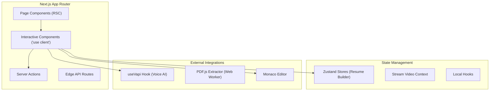

# 🖥️ PrepWise Frontend Architecture

> **Next.js 16 App Router** · Server Components · Server Actions · Zustand · Tailwind v4

The PrepWise frontend is a massive, highly-interactive web application that orchestrates complex UI states, WebRTC video streams, WebSocket AI audio, and real-time code execution—all while maintaining peak performance via React Server Components (RSC).

---

## 📐 Architecture Overview

### Why Next.js 16 App Router?
- **Zero-Bundle Static Content**: Career roadmaps, cheatsheets, and DSA problem descriptions are rendered entirely on the server. No React JS is shipped to the client for these reading-heavy pages.
- **Server Actions**: Form submissions (like saving a resume) bypass traditional API route boilerplate, ensuring end-to-end type safety with Prisma.

---

## 🧩 Core Modules Breakdown

### 1. AI Interview Room (`/app/interview/ai/room/[id]`)
**Purpose**: The flagship feature. Orchestrates Stream Video SDK and VAPI Voice AI.
- **Request Flow**:
  1. User enters room. Stream `Call` object is initialized.
  2. Component waits 1500ms for Stream to claim devices (prevents Windows `NotFoundError` race conditions).
  3. Fetches dynamic VAPI configuration payload built from user's parsed Resume.
  4. Mounts `AIParticipantCard` and binds to `useVapi` hook to display real-time speaking waveforms and live transcripts.
- **Performance**: Streams are kept out of React state to prevent cascading re-renders. Video grids use CSS grid implementations provided by Stream SDK.

### 2. Resume Parsing Pipeline (`/app/resume`)
**Purpose**: Extracts text from PDFs locally, then structures it via LLMs.
- **Request Flow**:
  1. `pdf.js` reads the file natively in the browser (zero upload latency, completely private).
  2. Extracted raw text is passed to Server Action `parseResumeWithGrok()`.
  3. Groq's LLaMA 3 processes the text into a strict Zod-validated JSON structure in < 2 seconds.
  4. JSON hydrates the Zustand store (`useResumeStore`).
- **Tech Purpose**: Zustand allows multi-step form editing across deeply nested components without React Context re-render hell.

### 3. Code Execution Sandbox (`/app/dsa`)
**Purpose**: Interactive LeetCode-style environment.
- **Components**: Integrates `@monaco-editor/react`.
- **Flow**: User types code -> Debounced local state -> Click Run -> POST to backend `/api/execution/run` -> Backend Judge0 -> Returns Output/Error.

---

## 🔐 Security & Auth

PrepWise uses **Clerk** for robust authentication.

- **Middleware (`middleware.ts`)**: Applies `clerkMiddleware()`. Any route not explicitly marked public throws a 401.
- **Session Tokens**: Handled automatically in HTTP-only cookies.
- **Route Protection**: Every API Route calls `await auth()`. If `userId` is missing, the request terminates immediately. All database reads are scoped (`where: { userId }`).

---

## ⚡ Performance Optimizations

1. **Lazy Loading**: Monaco editor and `pdf.js` worker are massive dependencies. They are dynamically imported (`next/dynamic`) only when the user navigates to the DSA or Resume pages.
2. **Optimistic Updates**: Server Actions (like marking a topic complete) use React's `useOptimistic` to update UI instantly while the DB write happens asynchronously.
3. **Image Optimization**: All avatars and assets use `next/image` for WebP compression and lazy loading.

---

## 🪝 Custom Hooks Reference

| Hook | Purpose | Interactions |
|---|---|---|
| `useVapi.ts` | Orchestrates VAPI Web SDK. | Handles WebSockets, manages `isSpeaking` state for UI animations, tracks `transcript` array, provides `startCall` and `stopCall` methods. |
| `useDebounce.ts` | Rate limits rapid inputs. | Used in Monaco editor to prevent excessive state updates while typing. |

---

## ⚙️ Environment Configuration

| Variable | Description | Required | Example |
|---|---|---|---|
| `DATABASE_URL` | Neon Pooled Postgres URL | ✅ | `postgresql://neondb_owner...` |
| `NEXT_PUBLIC_CLERK_PUBLISHABLE_KEY` | Clerk Auth Client Key | ✅ | `pk_test_...` |
| `CLERK_SECRET_KEY` | Clerk Auth Server Key | ✅ | `sk_test_...` |
| `GROK_API_KEY` | Groq LPU Inference Key | ✅ | `gsk_...` |
| `NEXT_PUBLIC_VAPI_API_KEY` | VAPI Client Key (Transient enabled) | ✅ | `...` |
| `VAPI_API_KEY` | VAPI Server Key (for Transcripts) | ✅ | `...` |
| `NEXT_PUBLIC_STREAM_API_KEY` | GetStream Client Key | ✅ | `...` |
| `STREAM_SECRET` | GetStream Server Token Signer | ✅ | `...` |
| `NEXT_PUBLIC_API_URL` | Backend execution endpoint | ✅ | `http://localhost:5000/api` |

---

## 🩺 Troubleshooting

**Video is blinking or AI throws `daily-error: ejected`:**
- **Cause**: Race condition between Stream Video SDK and VAPI trying to capture the microphone simultaneously on Windows.
- **Fix**: Do NOT manually invoke `navigator.mediaDevices.getUserMedia` in your layout. Let the `MeetingRoom` 1.5s delay handle the sequential capture.

**Groq Parsing returns 429:**
- **Cause**: Free tier token limits.
- **Fix**: The application has graceful fallbacks. It will catch the error and fallback to the user's previously saved resume in the database automatically.
